# Personal assistant action queue

An add-on to my personal assistant setup (currently [Hermes Agent](https://hermes-agent.org), an open-source agent harness).

- Scans data sources (such as emails, texts, finance)
- Builds a queue of suggested actions (update a calendar event, file a texted PDF, archive an email)
- Queue items show as cards with suggested actions

Additionally:

- Builds per-person finance reports for specific categories, runs research tasks, and audits the system
- Bonus: a dashboard with recent tool-use history, trends, and Model Context Protocol (MCP), service, and cron status

The goal is to lighten the mental load of tracking information that comes from many sources and could belong in many destinations. New actions and modules are quick to add.

This repo is a slice of that larger setup, with sample data. It's built for my own needs, so treat it as ideas and inspiration rather than a perfect fit for everyone else.

## What's in this repo

- `app/` — the web pages and their shared scripts
- `services/actions/` — the Python service behind the actions page: scanners, queue, finance, research, audit ([setup notes](services/actions/SETUP.md))
- `services/mcp/` — mini MCP servers exposing tool APIs
- `hermes/` — Hermes Agent integration: a status tool and a skill ([setup notes](hermes/iris-status/SETUP.md))
- `screenshots/` — images for this README

## The actions page

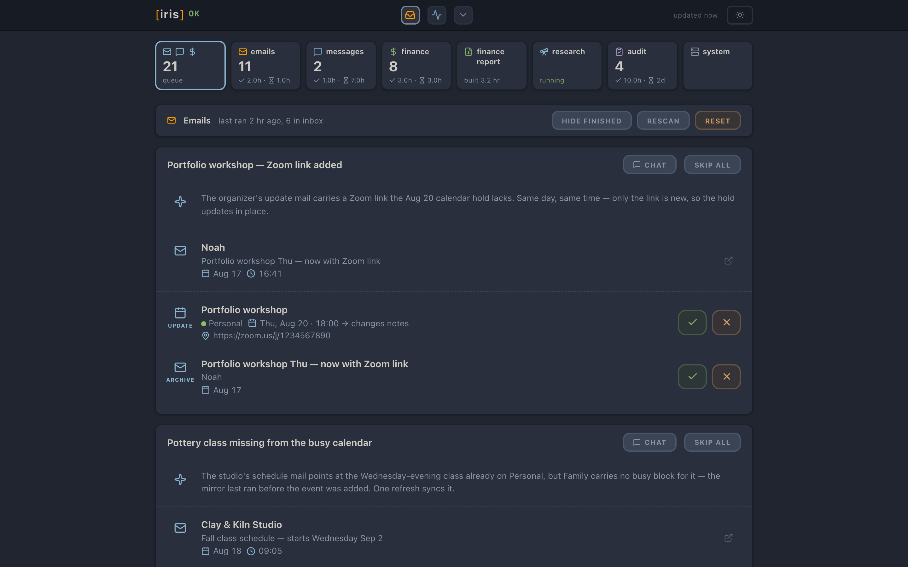

Modules are listed on top. The count shows pending actions and notices:

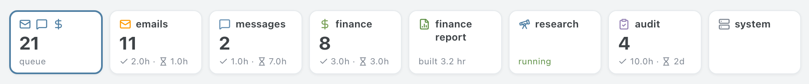

### Example: updating a calendar event from an email

The first half of an action item. An email arrived with a new Zoom link for an event already on the calendar. The assistant explains what it found, with a link to the source email:

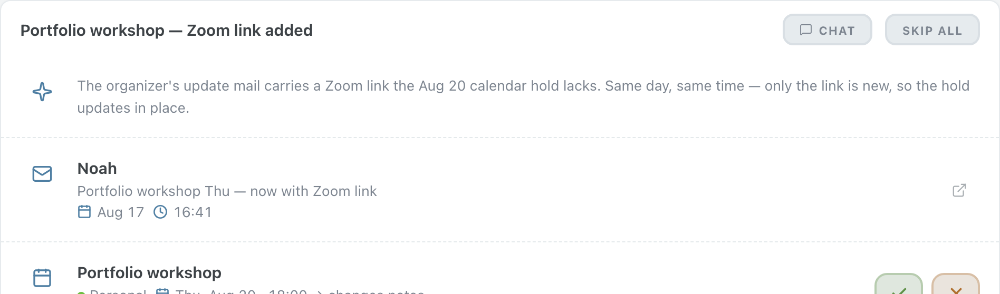

Below that, two suggested actions — update the event, archive the email:

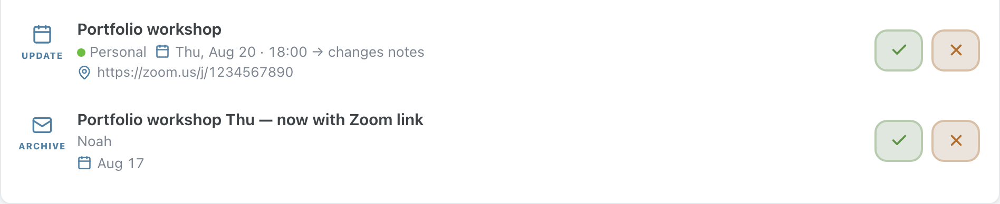

### Example: categorizing transactions from an email

The same idea elsewhere. I emailed three numbered questions about credit card charges; each answer comes back as a categorization to approve:

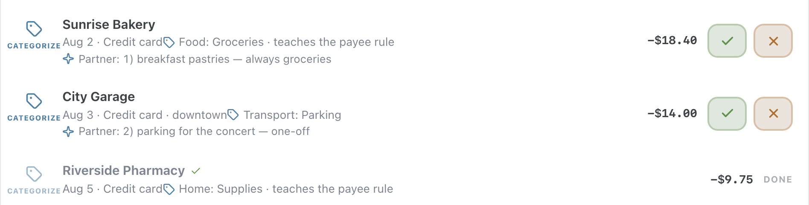

### Example: filing a PDF from a text chat

PDF texted in a family chat, with a guessed folder and the extracted text:

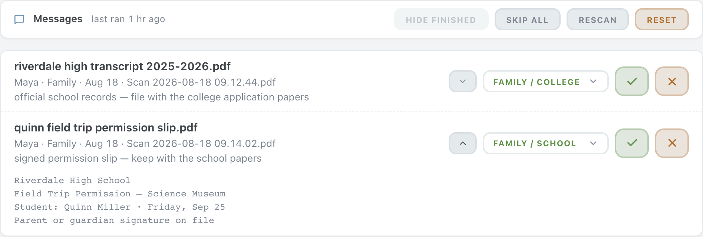

## Additional tabs

Three smaller tabs round out the actions page. Not all of their machinery is part of this slice. The finance report area is a stub that returns canned sample text. The research and audit areas are the real modules, but the scripts they trigger are not included, so their run buttons have nothing to call here.

The finance report builds the daily report email on demand and shows the text. Nothing runs against the budget, nothing is emailed:

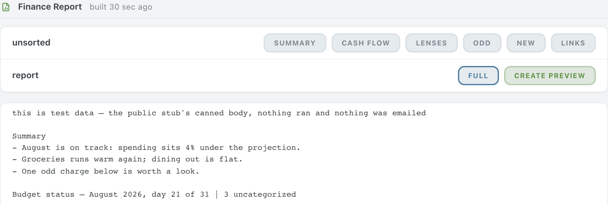

The research area: recurring web-research topics, each with its cadence and last run. A topic that keeps failing gets flagged:

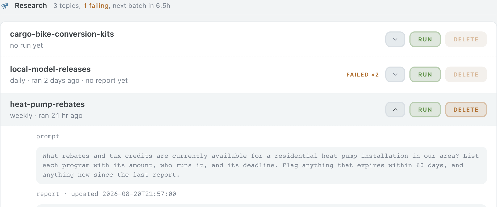

The audit area runs a scripted audit of the whole setup; each category with findings gets a card:

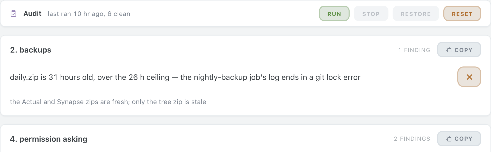

## The dashboard

The behind-the-scenes page: which tools were called, which MCP servers, services, and cron jobs are running, and what's failing. Shown here: recently called Hermes jobs with their parameters, and a chart of tool calls over the last hour, day, and week.

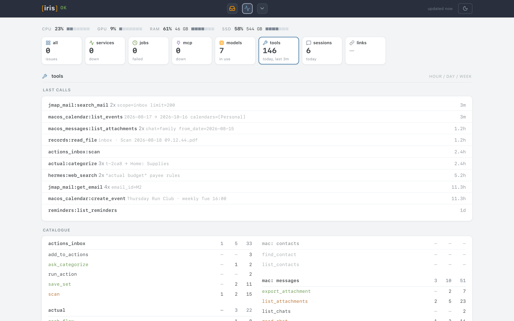

## Rationale

### Principles

- Autonomous AI actions can read data, but can't make changes or transmit anything
- Scripts are predictable and preferred over LLM when applicable
- Changes by LLM either have to go through strict guards, or get user approval

So the actions page flow is:

- scripts and LLM periodically scan emails, texts, calendar, and other changes
- suggested action cards go into a queue
- action cards run only as scripts with preset parameters (no LLM randomness at this stage)
- I approve, tweak, chat, or reject each card

Hermes and other harnesses have approval flows too, but here approvals don't expire, validation runs before and after the action, and I can preview cards at a glance.

### Why local?

Learning by doing, plus privacy: personal data and its permissions stay on my machine.

Note: we're in the early days of LLMs — solutions can get outdated within a week, and development moves fast. Chances are good we'll be looking at a completely different stack in a few months.

### Tech stack

- Python for the services; framework-free JavaScript and HTML for the pages, with no build step
- Hermes Agent, primarily for gateway features (in and out via email, Matrix, chat, etc). If it weren't for the gateways, [pi.dev](https://pi.dev) might have been an option too.
- macOS, since family is on the iCloud ecosystem
- mini MCP servers: a standardized way to declare toolset APIs; also handy while I was testing different harnesses

Skipped: n8n and similar tools specialize in automation, and are worth it for more professional projects, but overkill for a personal project where a few scripts are enough.

### Why the name Iris?

The original implementation had a few LLM harnesses that worked together, and I picked robot names from the old Infocom text adventure Suspended. A few waves of iteration later, only Iris was left.

## Interface details

A closer look at details from both pages.

An email mentions an event that the shared Family calendar has no busy block for yet (a mirror copies Personal events to the Family calendar as busy blocks). One sync row refreshes it:

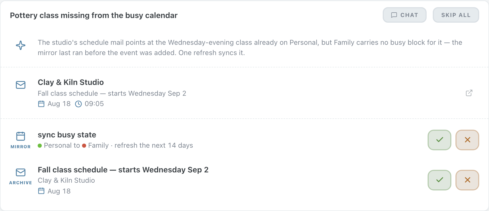

A row expands to its exact arguments, the conditions it runs under, and the raw JSON:

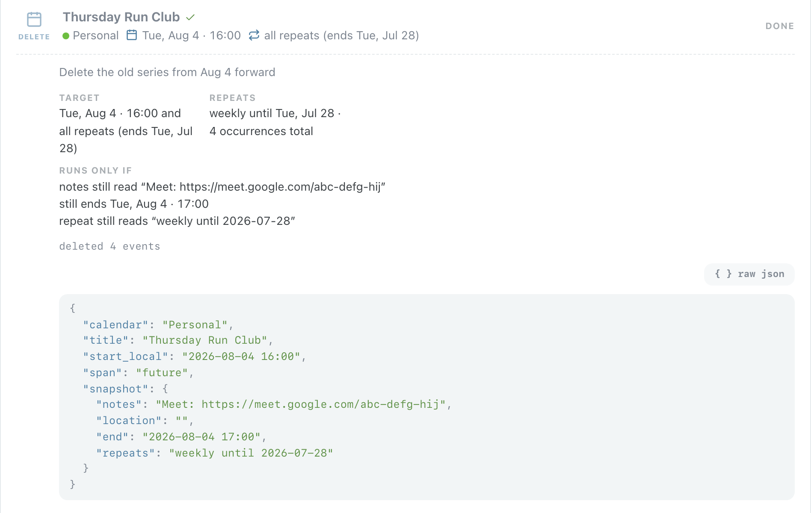

A source email expands to show its text:

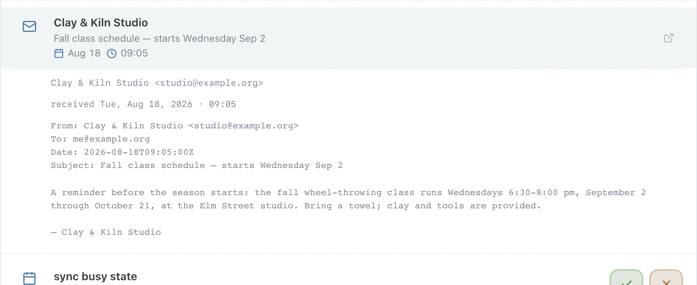

Approved rows run, then read back as done, denied, or failed:

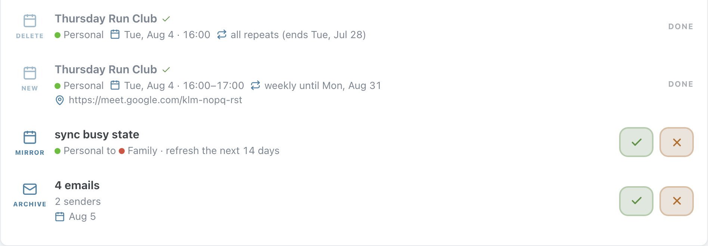

A precheck failure: the event changed after it was proposed, so the row never ran:

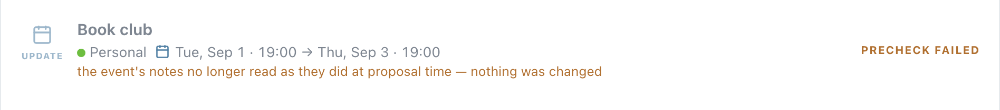

Every button that changes something is two-tap: the first tap arms it for five seconds, the second fires:

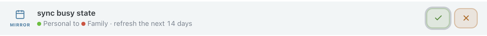

The finance area mid-review: one row per transaction, categories pre-picked, and a submit-all button that sends every valid row in one write:

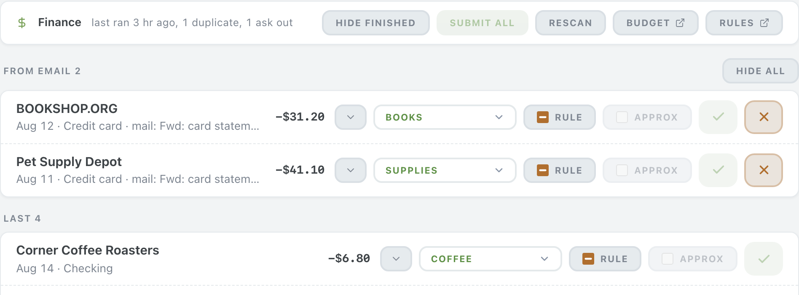

No suggested category? The row opens straight into the inline create-category form:

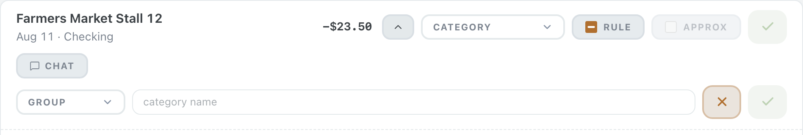

The system console: long-lived processes, uptime, two-tap restart:

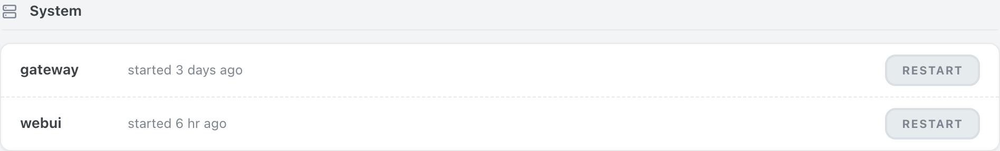

Both pages are iOS home-screen apps; most approvals happen from a phone:

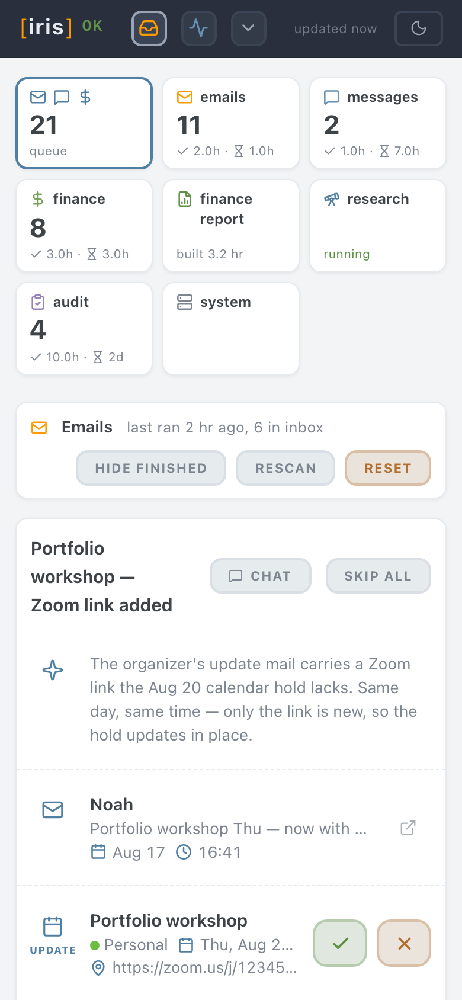

Dashboard panels: scheduled jobs with interval, last run, and a run button...

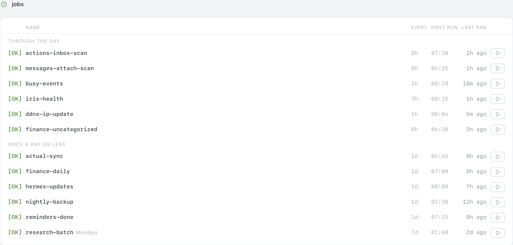

...the tool catalogue, parsed from the MCP server sources, with hour/day/week call counts...

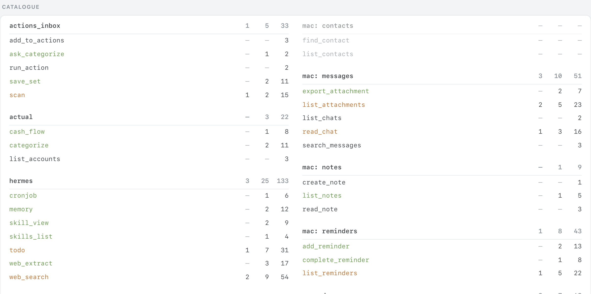

...and sessions grouped by model:

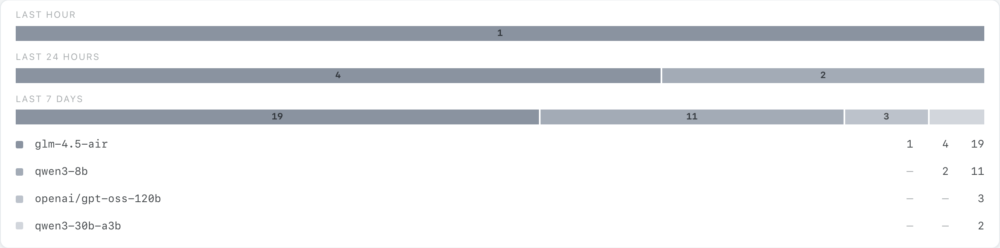

The dashboard on a phone:

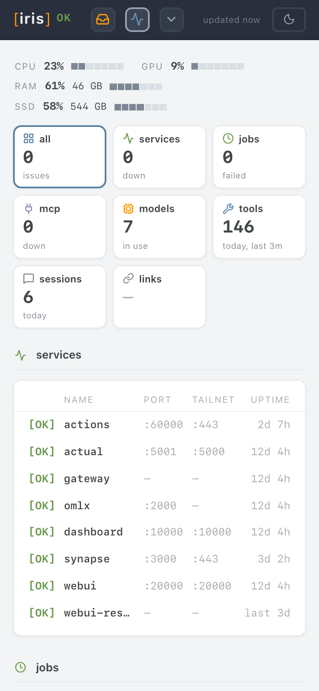

## License

[MIT](LICENSE). Icons inlined in the pages are from [Lucide](https://lucide.dev) (ISC).
